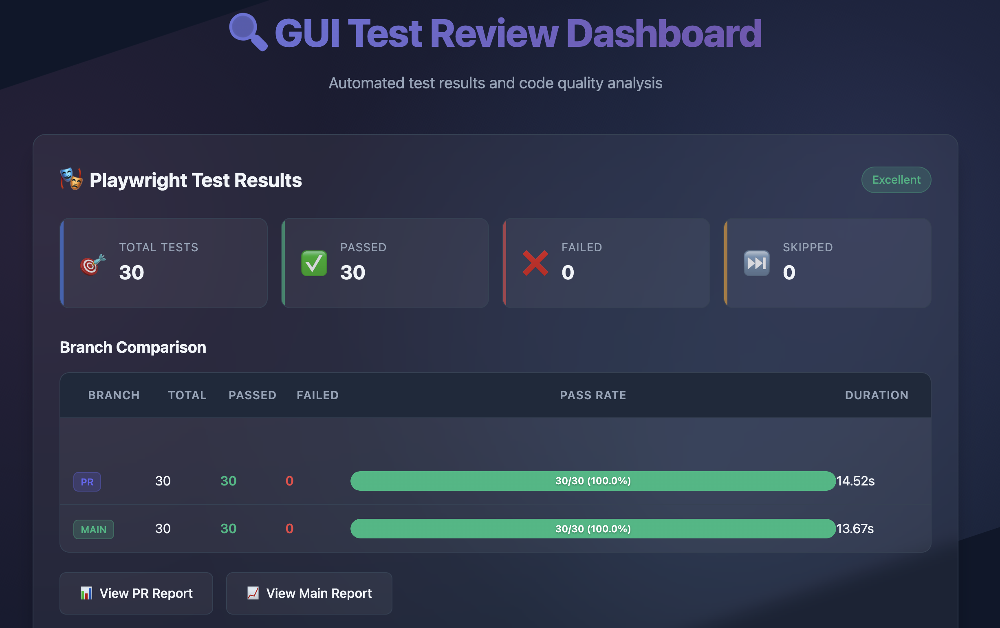

# GUI-Based Testing Code Review

> 🔍 Enhance pull request reviews with visual testing feedback, automated quality checks, and interactive dashboards

[](https://github.com/marketplace/actions/gui-based-testing-code-review)
[](https://opensource.org/licenses/MIT)
[](https://playwright.dev/)



## ✨ What This Does

Automatically captures and displays visual context from your Playwright tests directly in GitHub pull requests - no more asking reviewers to run tests locally to understand what changed.

### 🎯 Key Features

- **🔄 Visual Comparison** - Side-by-side test results from PR vs main branch
- **📊 Interactive Dashboard** - Beautiful test reports with flowcharts and metrics  
- **📋 Review Checklists** - Automated tracking of review completeness
- **🎨 Code Quality** - ESLint/Prettier checks with inline PR feedback via reviewdog
- **🚀 Modular Design** - Use all-in-one or integrate with existing CI/CD
- **💡 Actionable Insights** - Regression detection, flaky test identification, and prioritized recommendations
- **🏙️ 3D Test City Visualization** - Interactive 3D representation of your test suite
- **⚡ Quick Actions Panel** - Context-aware commands and GitHub actions

## 🚀 Quick Start

Add to your workflow in 30 seconds:

```yaml
name: GUI Test Review
on: [pull_request]

jobs:
  test-review:
    runs-on: ubuntu-latest
    permissions:
      contents: read
      pull-requests: write
      pages: write
      id-token: write
    
    steps:
      - uses: actions/checkout@v4
      - uses: DigitalProductInnovationAndDevelopment/Code-Reviews-of-GUI-Tests@v1
        with:
          github-token: ${{ secrets.GITHUB_TOKEN }}
          enable-visual-comparison: 'true'  # Compare PR vs main
```

**That's it!** The action will:
1. Run your Playwright tests with automatic retries
2. Check code quality with ESLint/Prettier
3. Analyze test failures and identify patterns
4. Generate an interactive dashboard with performance metrics
5. Create a 3D visualization of your test suite
6. Compare screenshots between branches
7. Post an insightful summary comment on your PR

## 🏗️ Required Project Structure

```
your-gui-project/
├── tests/                          # GUI test files
│   ├── *.spec.{js,ts,tsx}         # Playwright test files
│   └── fixtures/                   # Test data and fixtures
├── scripts/                        # Action scripts (auto-included)
├── package.json                    # Dependencies
├── playwright.config.js            # Playwright configuration
├── .eslintrc.json                  # ESLint configuration (optional)
├── .prettierrc.json               # Prettier configuration (optional)
└── README.md                       # Project documentation
```

## 📦 Required Dependencies

Add these to your `package.json`:

```json
{
  "devDependencies": {
    "@playwright/test": "^1.52.0",
    "@mermaid-js/mermaid-cli": "10.6.1",
    "@octokit/core": "^5.0.0",
    "@typescript-eslint/eslint-plugin": "^8.35.0",
    "@typescript-eslint/parser": "^8.35.0",
    "eslint": "^8.0.0",
    "eslint-plugin-playwright": "^2.2.0",
    "eslint-plugin-prettier": "^5.5.1",
    "marked": "15.0.12",
    "prettier": "^3.3.2"
  }
}
```

Add these to your `playwright.config.js`:

```javascript
const { defineConfig } = require('@playwright/test');

module.exports = defineConfig({
  testDir: './tests',
  use: {
    headless: true,
    screenshot: 'on',
    trace: 'on',
    video: 'off',
    ignoreHTTPSErrors: true,
  },
  reporter: [
    ['list'],
    ['json', { outputFile: 'playwright-metrics.json' }],   // ← relative path
    ['html', { outputFolder: 'playwright-report', open: 'never' }],
  ],
});
```

## 🔧 Common Configurations

### Use with Existing Tests

Already running tests? Just add the dashboard:

```yaml
jobs:
  your-tests:
    # ... your existing test job
    
  dashboard:
    needs: [your-tests]
    runs-on: ubuntu-latest
    steps:
      - uses: actions/checkout@v4
      - uses: actions/download-artifact@v4
      - uses: DigitalProductInnovationAndDevelopment/Code-Reviews-of-GUI-Tests@v1
        with:
          mode: 'dashboard-only'
```

### Separate Lint and Test Jobs

```yaml
with:
  mode: 'test-only'  # or 'lint-only'
```

### Key Inputs

| Input | Description | Default |
|-------|-------------|---------|
| `mode` | `full`, `test-only`, `lint-only`, `dashboard-only` | `full` |
| `enable-visual-comparison` | Compare PR vs main branch | `false` |
| `enable-github-pages` | Deploy dashboard to Pages | `true` |
| `test-files` | Test file pattern | `tests` |
| `max-test-retries` | Maximum retries for flaky tests | `2` |
| `enable-pr-comments` | Post summary comment on PRs | `true` |
| `fail-on-test-failure` | Fail job if tests fail | `false` |
| `artifacts-retention-days` | Days to retain artifacts | `30` |
| `enable-3d-visualization` | Enable 3D Test City visualization | `true` |
| `enable-visual-regression` | Enable visual regression testing | `true` |
| `enable-test-history` | Track test history for flakiness | `true` |
| `custom-artifacts-path` | Path for dashboard-only mode | `''` |
| `main-branch` | Main branch for comparison | `main` |


### Enhanced Outputs

| Output | Description |
|--------|-------------|
| `test-results` | JSON summary of Playwright results |
| `dashboard-url` | Deployed dashboard URL |
| `has-failures` | Boolean indicating if any tests failed |
| `failure-details` | JSON array of failed test names |
| `execution-time` | Total execution time in seconds |
| `performance-metrics` | JSON object with performance data |
| `gui-regression-detected` | `true` if regression detected vs main |
| `flaky-tests` | JSON array of flaky test names |
| `visual-regression-summary` | Visual regression test results |
| `test-city-url` | URL to 3D Test City visualization |
| `review-checklist-status` | Checklist completion status |
| `code-quality-score` | Overall quality score (50–100) |
| `pr-test-results` | PR branch test summary |
| `main-test-results` | Main branch test summary |


[📚 **Full Configuration Guide →**](https://github.com/DigitalProductInnovationAndDevelopment/Code-Reviews-of-GUI-Tests/wiki/Configuration-Reference)

## 📊 What You Get

- **PR Comment** posts a concise test summary with key metrics.  
- **Interactive Dashboard** displays real-time test flows and detailed results.  
- **Inline Code Review** injects automated feedback via reviewdog directly into pull requests.  
- **Visual Comparisons** highlight UI differences between the current branch and main.  
- **Review Checklist** automatically tracks the completion status of required review steps.  
- **Smart Test Failure Analysis** clusters failing tests to expose recurring patterns.  
- **Performance Tracking** records execution times and suggests optimization opportunities.  
- **3D Test City** renders an interactive cityscape where building height reflects test priority, color shows pass/fail, glow marks flaky tests, and districts map to suites.  
- **Quick Actions Panel** offers context-aware commands, GitHub CLI shortcuts, and ready-to-use code snippets.  
- **Test History Analysis** visualizes flaky tests, performance trends, and success rates over time.  


## 📚 Documentation

- [**Configuration Reference**](https://github.com/DigitalProductInnovationAndDevelopment/Code-Reviews-of-GUI-Tests/wiki/Configuration-Reference) - All inputs, outputs, and options
- [**Integration Patterns**](https://github.com/DigitalProductInnovationAndDevelopment/Code-Reviews-of-GUI-Tests/wiki/Integration-Patterns) - Advanced CI/CD setups
- [**Architecture Guide**](https://github.com/DigitalProductInnovationAndDevelopment/Code-Reviews-of-GUI-Tests/wiki/Architecture-Guide) - How it works under the hood
- [**Troubleshooting**](https://github.com/DigitalProductInnovationAndDevelopment/Code-Reviews-of-GUI-Tests/wiki/Troubleshooting-Guide) - Common issues and solutions

## 🤝 Contributing

This project was developed for the Digital Product Innovation and Development Seminar at TUM.

[📚 **Full Academic Context & References →**](https://github.com/DigitalProductInnovationAndDevelopment/Code-Reviews-of-GUI-Tests/wiki/Academic-Context-&-References)

## 📄 License
This project is licensed under the MIT License - see the [LICENSE](LICENSE) file for details.

## 🙏 Acknowledgments

- Built with [Playwright](https://playwright.dev/)
- Powered by [reviewdog](https://github.com/reviewdog/reviewdog)
- Visualizations with [Mermaid](https://mermaid-js.github.io/)
- GitHub integration via [Octokit](https://octokit.github.io/)
---

<p align="center">
  <a href="https://github.com/DigitalProductInnovationAndDevelopment/Code-Reviews-of-GUI-Tests/wiki">📖 Wiki</a> •
  <a href="https://github.com/DigitalProductInnovationAndDevelopment/Code-Reviews-of-GUI-Tests/issues">🐛 Issues</a> •
  <a href="https://github.com/DigitalProductInnovationAndDevelopment/Code-Reviews-of-GUI-Tests/discussions">💬 Discussions</a>
</p>
